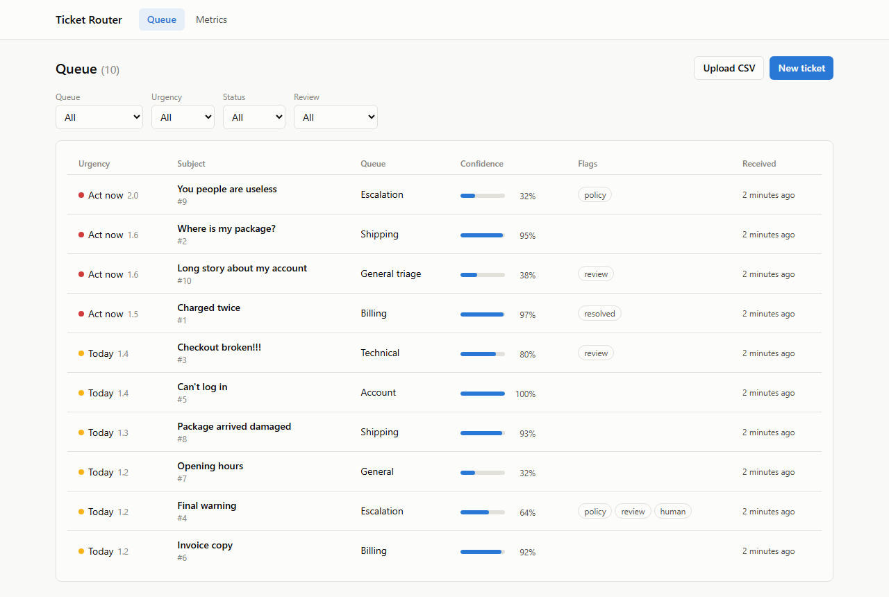
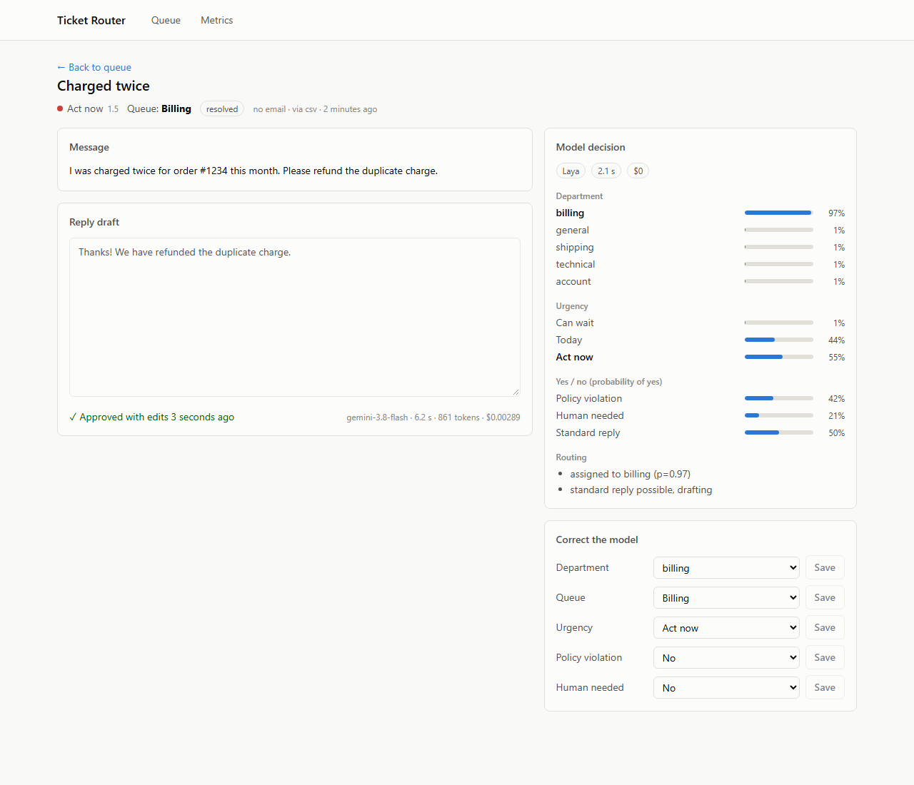
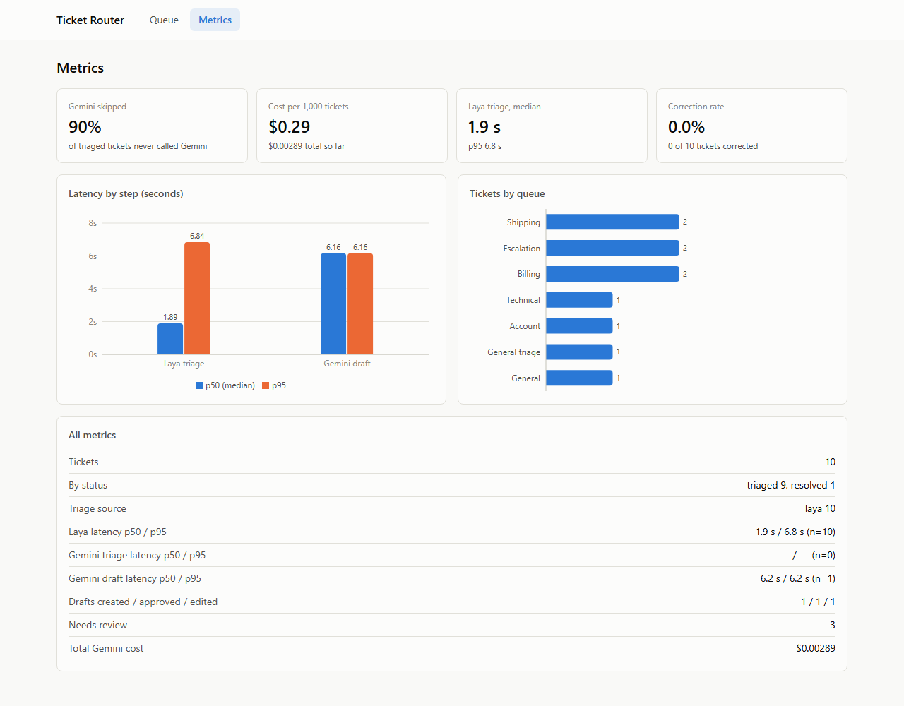
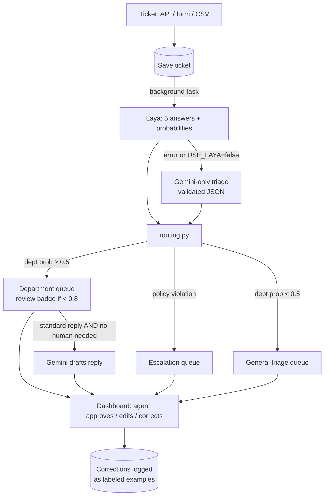

# Smart Support Ticket Router

A support-ticket triage system that routes every ticket with a small, local **decision model**
([Laya](https://huggingface.co/convaiinnovations/laya)) and calls an LLM ([Gemini](https://ai.google.dev/))
only when a reply actually has to be written. It ships with a benchmark against a Gemini-only pipeline
on 346 labeled tickets.

**Headline result:** Laya-first routing cost **$0.03 per 1,000 tickets vs. $0.87** for Gemini-only
(Gemini was skipped for 96% of tickets), but Gemini was **more accurate on every decision**
(91% vs. 85% department accuracy). [Full results ↓](#benchmark-results)



<p>
  
  
</p>

## How it works

Every ticket gets **one Laya call** that answers five typed questions at once. Laya returns
probabilities instead of generated text, so there's no JSON to parse and nothing to hallucinate.

| Question | Type | Answers |
|---|---|---|
| Which department? | choice | billing, technical, shipping, account, general |
| How urgent? | score | 0 = can wait days, 1 = handle today, 2 = act now |
| Abuse, fraud or a legal threat? | yes/no | probability of yes |
| Does a human need to decide? | yes/no | probability of yes |
| Can a standard reply resolve it? | yes/no | probability of yes |

Plain Python ([`routing.py`](backend/app/routing.py), a pure function) then applies the rules:

1. **Policy violation** → escalation queue, no draft
2. **Department probability < 0.5** → general triage queue for a human
3. **0.5–0.8** → assigned to the department, marked **review**
4. **≥ 0.8** → assigned automatically
5. **Gemini drafts a reply only if** standard reply = yes **and** human needed = no

Every threshold lives in `.env`, so tuning needs no code change. If Laya fails (or `USE_LAYA=false`),
a Gemini-only triage returns the same five answers as schema-validated JSON. That same path is the
benchmark baseline.



Every Laya and Gemini call records `latency_ms`, and every Gemini call records its tokens
(thinking tokens included) and cost, all stored per ticket.

## Benchmark results

346 labeled tickets: 240 from [Bitext](https://huggingface.co/datasets/bitext/Bitext-customer-support-llm-chatbot-training-dataset)
(account, billing, shipping, general), 60 tag-verified technical tickets from
[Tobi-Bueck](https://huggingface.co/datasets/Tobi-Bueck/customer-support-tickets), and 46 hand-written
hard cases (threats, fraud, sarcasm, account takeover, very short and very long messages).
Both pipelines use the app's own code and the same routing rules.

| | Laya-first | Gemini-only |
|---|---|---|
| Department accuracy | 84.7% | **91.0%** |
| Urgency: "act now" vs. not | 65.1% | **73.6%** |
| Policy violations caught (hard set) | 40% (2 of 5) | **100%** |
| "Human needed" accuracy (hard set) | 52% | **87%** |
| Tickets that never call Gemini | **96%** | 0% |
| Triage latency p50 / p95 (CPU) | 2.2 s / **3.6 s** | **1.6 s** / 4.9 s |
| Gemini cost per 1,000 tickets | **$0.03** | $0.87 |
| Calibration error, department (lower is better) | 0.215 | **0.049** |

<p>
  
  
</p>

**What the numbers say**

- **Laya is strong on four of five departments** (89–97% on billing, technical, shipping and account)
  but weak on the catch-all **general** class (33 of 68 correct). See the
  [confusion matrix](benchmark/results/charts/confusion_laya.png).
- **Laya is underconfident:** at a stated 55% it's right 93% of the time, so the 0.8 threshold
  sends 68% of tickets to review. For Laya, a threshold near 0.6 would be justified by the data.
- **Much of the cost gap comes from drafting less.** Laya almost never answers "standard reply = yes",
  so only 4% of tickets get a draft (vs. 60%). Triage alone is $0 vs. $0.44 per 1,000.
- **Laya isn't safe for policy detection as-is.** It missed 3 of 5 threats/fraud/abuse cases. Its model
  card says the base checkpoint is meant to be fine-tuned, and these results agree.
- **On CPU, Laya's median is slower than Gemini's API**; it wins on p95 and on cost. On a GPU, Laya's
  model card reports ~40 ms per call.

Full table, caveats and all charts: [`benchmark/results/report.md`](benchmark/results/report.md).

**Label caveats:** Bitext messages are short chat-style requests, easier than real email tickets.
Policy / human / standard-reply labels exist only for the 46 hand-written tickets, which I labeled
myself. The originally planned dataset (Tobi-Bueck alone) turned out to have queue labels that don't
match the ticket text, which is why the set combines sources. The reasoning is in
[`build_dataset.py`](benchmark/build_dataset.py).

## Quick start (Docker)

Needs Docker with at least 4 GB of memory (the Laya model uses ~2.5 GB).

```bash
cp .env.example .env          # add GEMINI_API_KEY for drafts + fallback (Laya works without it)
docker compose up --build     # first start downloads the Laya model (~1.7 GB)
```

- Dashboard: <http://localhost:8080>. Click **Upload CSV** and pick `data/sample_tickets.csv`
- API docs: <http://localhost:8000/docs>

This starts three containers: **Postgres**, the **FastAPI + Laya** backend, and the **React** dashboard
served by nginx (which also forwards `/api` to the backend). The model weights and the database live in
named volumes, so restarts are fast.

## Local development

Python 3.11 and Node 20+.

```powershell
# Backend (repo root)
py -3.11 -m venv .venv
.venv\Scripts\python -m pip install -r requirements.txt
copy .env.example .env
cd backend
..\.venv\Scripts\python -m pytest -q                         # 45 tests, no model or network needed
..\.venv\Scripts\python -m uvicorn app.main:app --port 8000  # SQLite at backend/tickets.db

# Frontend (second terminal)
cd frontend
npm install
npm run dev                                                   # http://localhost:5173
```

On macOS/Linux use `.venv/bin/python` and `cp`. If `laya.load()` hangs, make sure `USE_TF=0` is set
(it is in `.env.example`).

**Try the model directly:** `cd backend && ../.venv/Scripts/python -m scripts.run_samples` prints
Laya's answers, confidences and latency for 10 sample tickets.

**Re-run the benchmark:**

```powershell
.venv\Scripts\python benchmark\build_dataset.py     # download + label mapping -> data/benchmark_labeled.csv
.venv\Scripts\python benchmark\run_benchmark.py     # ~18 min on CPU, ~$0.20 of Gemini; resumes if interrupted
.venv\Scripts\python benchmark\evaluate.py          # free: recompute metrics + charts from saved predictions
```

## Project structure

```
backend/app/
  config.py         settings from .env: thresholds, departments, feature flags
  laya_client.py    the only file that touches laya: 5 questions, truncation, timing
  gemini_client.py  the only file that touches Gemini: drafts + fallback triage, cost tracking
  routing.py        pure routing rules (unit-tested with fake answers)
  pipeline.py       triage -> route -> save -> maybe draft; Laya→Gemini fallback
  models.py, db.py  SQLAlchemy tables: tickets, decisions, drafts, overrides
  main.py           FastAPI endpoints
  metrics.py        p50/p95 latency, cost, Gemini calls avoided, correction rate
backend/tests/      45 pytest tests (routing, parsing, Gemini client, API end-to-end)
frontend/src/       React + Vite + Tailwind + Recharts dashboard
benchmark/          dataset builder, benchmark runner, evaluation + charts
data/               sample tickets, hand-written hard set, labeled benchmark set
docs/PRD.md         product requirements
```

## API

| Method | Path | Purpose |
|---|---|---|
| POST | `/tickets` | Submit a ticket (triage runs in the background) |
| POST | `/tickets/bulk` | Upload a CSV (`subject`, `body`, optional `customer_email`) |
| GET | `/tickets?dept=&urgency=&needs_review=&status=` | Queue, most urgent first |
| GET | `/tickets/{id}` | Ticket with model decisions, drafts and corrections |
| PATCH | `/tickets/{id}/decision` | Agent correction (logged as an override) |
| POST | `/tickets/{id}/draft/approve` | Approve a draft, optionally edited |
| GET | `/metrics` | Latency, cost, Gemini calls avoided, correction rate |
| GET | `/health` | Model and config status |

## Design decisions

- **Adapters around both models.** `laya_client.py` and `gemini_client.py` are the only files that know
  either SDK. Everything else uses one `TriageResult` shape, which is what makes the fallback and the
  benchmark possible without special cases.
- **Model output is never edited.** A `decisions` row stores what the model said. The `tickets` row holds
  the current state, which agents change. Comparing the two gives the correction rate, and every
  correction becomes a labeled example.
- **Routing before drafting.** The routing decision is committed before Gemini drafts, so a slow or
  failed draft never loses the routing.
- **Laya loads once** at startup and is shared behind a lock (one ~2 GB model, one call at a time).
- **Confirming isn't correcting.** "Model is right" clears the review badge without counting against the
  model's correction rate.
- **Known limits:** English-only (Laya's English checkpoint fails on other languages), ~320 tokens of
  ticket text per question (longer tickets are truncated and flagged), polling rather than WebSockets,
  and FastAPI `BackgroundTasks` rather than a real job queue.

## Deployment

`docker-compose.yml` is the deployment config. Because the backend needs ~2.5 GB of RAM for Laya, free
tiers (Render/Railway at 512 MB) can't run it. A small VM with 4 GB+ (for example a $20–25/month
droplet or EC2 `t3.medium`) running `docker compose up -d` works. Before exposing it publicly, set
`POSTGRES_PASSWORD` in `.env`, and add authentication: the API has none, which is fine for a demo only.


