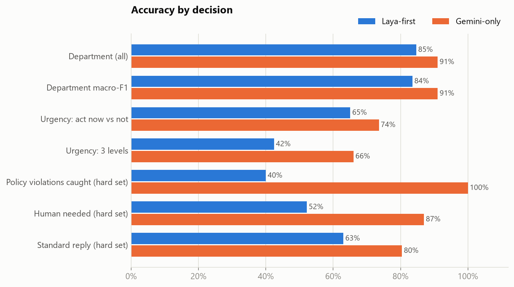
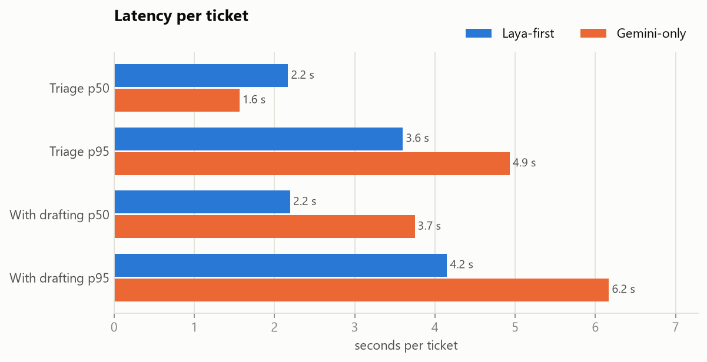
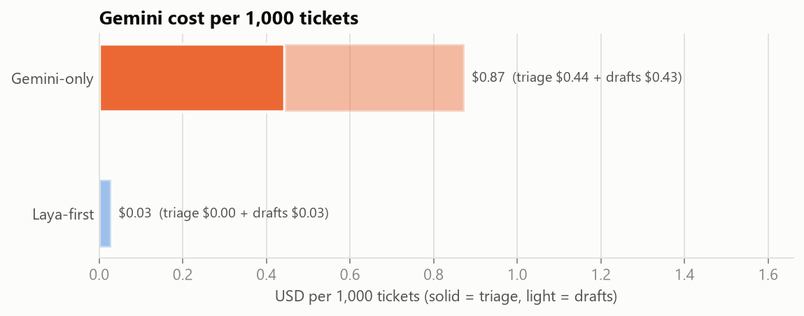
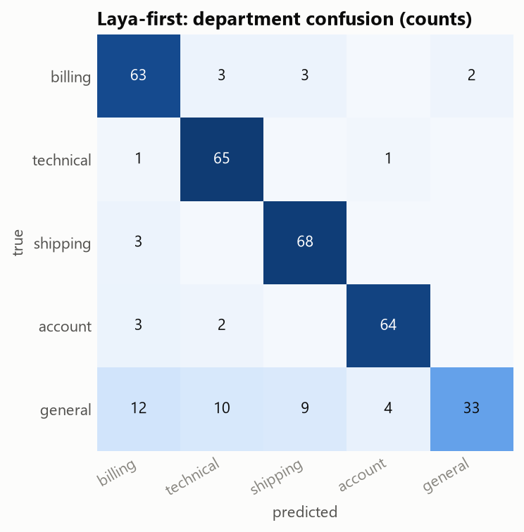
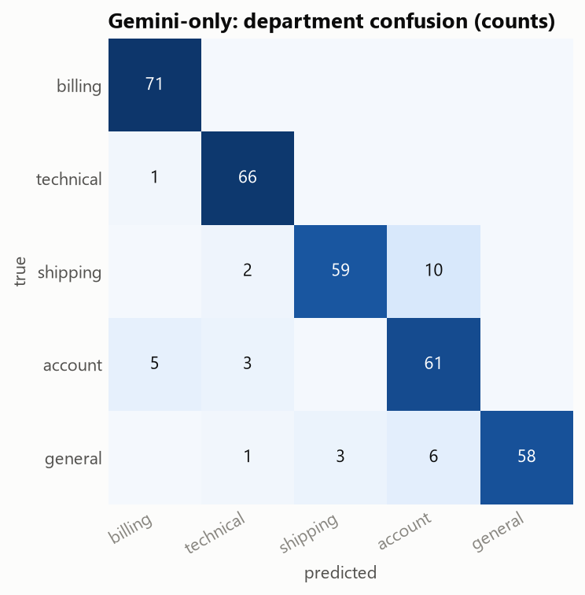
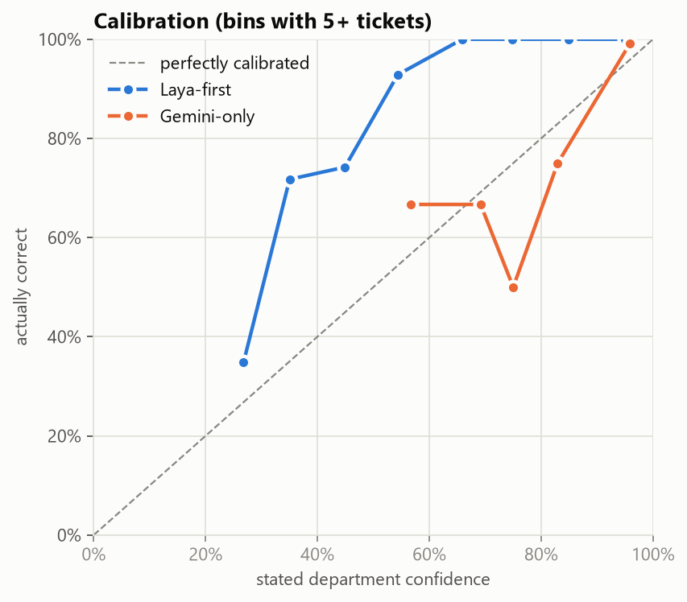

# Benchmark: Laya-first vs Gemini-only

Generated by `benchmark/evaluate.py`. Re-run `benchmark/run_benchmark.py` to reproduce.

**Dataset:** 346 labeled tickets: 240 from Bitext (account, billing, shipping,
general), 60 technical tickets from Tobi-Bueck, and 46 hand-written hard cases.
See `benchmark/build_dataset.py` for sources, filtering and label mapping.

| Metric | Laya-first | Gemini-only |
|---|---|---|
| Department accuracy (all) | 84.7% | 91.0% |
| Department accuracy (Bitext, 240) | 82.9% | 87.5% |
| Department accuracy (Tobi technical, 60) | 98.3% | 100.0% |
| Department accuracy (hard set) | 76.1% | 97.8% |
| Department macro-F1 | 0.835 | 0.911 |
| Urgency: act now vs not (Tobi + hard) | 65.1% | 73.6% |
| Urgency: exact level 0/1/2 (Tobi + hard) | 42.5% | 66.0% |
| Policy violations caught (hard set recall) | 40.0% | 100.0% |
| Policy precision (hard set) | 22.2% | 83.3% |
| Policy false alarms (public set) | 3.3% | 1.7% |
| Human needed accuracy (hard set) | 52.2% | 87.0% |
| Standard reply accuracy (hard set) | 63.0% | 80.4% |
| Marked for review | 68.2% | 8.4% |
| Tickets drafted | 4.0% | 60.1% |
| Tickets that never call Gemini | 96.0% | 0.0% |
| Triage latency p50 | 2.17 s | 1.56 s |
| Triage latency p95 | 3.60 s | 4.93 s |
| End-to-end p50 (incl. drafts) | 2.19 s | 3.75 s |
| End-to-end p95 (incl. drafts) | 4.15 s | 6.17 s |
| Gemini cost per 1,000 tickets | $0.03 | $0.87 |
|   of which triage | $0.00 | $0.44 |
|   of which drafts | $0.03 | $0.43 |
| Department calibration error (ECE, lower is better) | 0.215 | 0.049 |
| Failed tickets | 0 | 0 |
| Tickets truncated for Laya | 0 | 0 |

**How cost and latency are counted**
- Laya runs locally on CPU, so its triage costs $0 in API fees (hardware not included).
- Gemini cost uses logged token counts (thinking tokens billed as output) at the prices in `.env`.
- Drafting: each pipeline drafts only where its own routing says so. Draft cost and latency are the
  mean of 20 real drafts: $0.00072 and 2.4 s per draft.

**Label caveats**
- Bitext departments come from its intent labels (mapping in `build_dataset.py`). Bitext messages are
  short chat-style requests, easier than real email tickets.
- Tobi-Bueck's queue labels are noisy, so only technical tickets whose tags agree were kept; a few are
  still borderline (e.g. marketing tools). Its priority field is the urgency label.
- Policy / human-needed / standard-reply labels exist only for the hand-written hard set. Public tickets
  are assumed to contain no policy violations (swearing isn't one).
- Hard-set labels were written for this project and are a judgment call on ambiguous tickets.

