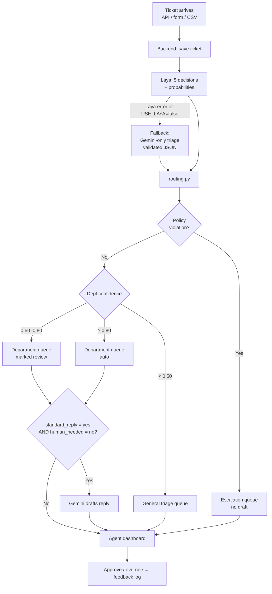

# PRD: Smart Support Ticket Router (Laya + Gemini)

Sep 23, 2026 · @affan · v2 (replaces "Jev + LLM" version: Jev → Laya, Claude → Gemini)

## Overview & problem

The Smart Support Ticket Router reads each incoming customer message and uses **Laya**, an open-source decision model, to decide department, urgency, policy risk, whether a human is needed and whether a standard reply would resolve it. It calls **Gemini** only when a reply draft is actually needed.

Small and mid-size support teams handle tickets by hand: someone reads every message, tags it and forwards it. Urgent issues (a customer about to cancel, a failed payment) wait in the same queue as simple questions. Teams that use an LLM for triage pay for slow, token-by-token generation just to get a label, and then have to parse and validate JSON output.

Laya (`convaiinnovations/laya` on Hugging Face) doesn't generate text. It takes a *state* (the ticket) plus typed questions (choice, score, yes/no) and returns typed answers with probabilities. It runs locally, so triage costs no API money. That makes it a natural fit for triage, and Gemini handles the one step that needs writing: the reply draft.

## Goals, non-goals & success metrics

The project succeeds if it routes tickets as accurately as a Gemini-only pipeline while being at least 10x cheaper and faster, proven with a published, re-runnable benchmark.

**Goals**

- Classify every ticket on five decisions: department, urgency, policy violation, human needed, standard reply.
- Use a Laya-first pipeline where Gemini runs only for tickets that need a drafted reply.
- Give agents a dashboard with a live queue, sorted by urgency, with confidence scores visible.
- Benchmark Laya-first against a Gemini-only baseline on the same labeled dataset.

**Non-goals (v1)**

- Sending replies to customers automatically. Drafts always need agent approval.
- Integrations with Zendesk, Freshdesk or email inboxes (v2).
- Multi-tenant billing, SSO, or production-grade scaling.
- Non-English tickets. The English Laya checkpoint fails on them (see Risks).

**Success metrics**

| Metric | Target | How measured |
|---|---|---|
| Department routing accuracy | ≥ 90% | Labeled test set, 300+ tickets |
| Urgency accuracy ("act now" vs. not) | ≥ 88% | Same test set |
| Median triage latency (Laya) | < 2.5 s on CPU / < 150 ms on GPU | `latency_ms` logged per call, p50 and p95 |
| Cost per 1,000 tickets | ≥ 10x lower than Gemini-only | Gemini token usage logged per call |
| Gemini calls avoided | ≥ 50% of tickets | Count of tickets with no draft needed |
| Agent correction rate | < 10% | Overrides in dashboard |

## Target users & user stories

The primary user is a support agent at a small online business (e-commerce, SaaS, telecom) handling 100 to 2,000 tickets a day.

| Persona | Needs |
|---|---|
| Support agent | See the most urgent tickets first; get a ready draft for common issues |
| Support team lead | Know queue health, SLA risk and how often the AI is wrong |
| Customer | Get a fast, correct response without being bounced between departments |
| Developer (you) | Tune decision labels and thresholds without code changes |

**User stories**

- As an agent, I want tickets sorted by urgency so that angry or at-risk customers are answered first.
- As an agent, I want each ticket pre-assigned to Billing, Technical, Shipping, Account or General so that I don't have to forward it.
- As an agent, I want a suggested reply for routine tickets so that I can answer in one click after reviewing.
- As an agent, I want to correct a wrong label so that the system's mistakes are tracked.
- As a team lead, I want tickets flagged for abuse, fraud or legal threats so that they go to a senior person.
- As a team lead, I want a metrics page showing accuracy, latency and cost so that I can trust the system.

## Core features & decision schema

Every ticket gets **one** Laya `predict` call that answers all five questions. Plain Python in `routing.py` then acts on the answers.

**Laya decision schema** (uses Laya's three question types: `choice`, `score`, `noul` = yes/no)

| Key | Question | Type | Allowed answers | Drives |
|---|---|---|---|---|
| `department` | Which department should handle this? | choice | billing, technical, shipping, account, general | Queue assignment |
| `urgency` | How urgent is this? | score (3 labeled levels) | 0 = can wait days, 1 = handle today, 2 = act now | Sort order, SLA timer |
| `policy_violation` | Abuse, fraud or legal threat? | noul | yes / no | Escalation queue, no draft |
| `human_needed` | Does a human need to decide? | noul | yes / no | Blocks auto-draft |
| `standard_reply` | Can a standard reply fully resolve it? | noul | yes / no | Gemini draft |

*The exact question format and response shape come from the installed `laya` package and model card. Phase 1 confirms them before anything is built on top.*

**Laya input limits (design constraints)**

- 512 tokens **per question**. Laya builds one sequence per question (question and options, then the ticket), and the question plus options are capped at 192 tokens. That leaves roughly 320 tokens (~1,200 characters) of ticket text per question. Laya silently cuts off anything longer, so we truncate explicitly and log when it happens. Question wording stays short.
- Choice questions stay under about 20 options (we use 5).
- The Laya model is loaded **once** at app startup, not per request. If `laya.load()` hangs, set `USE_TF=0`.

**Routing rules** (in order, in `routing.py`)

1. `policy_violation = yes` → **escalation** queue, no draft.
2. Department confidence < `MIN_CONFIDENCE` (0.50) → **general_triage** queue for a human, no draft.
3. Department confidence between `MIN_CONFIDENCE` and `AUTO_CONFIDENCE` (0.50–0.80) → assign to the department but mark it **review**.
4. Department confidence ≥ `AUTO_CONFIDENCE` → assign automatically.
5. Gemini drafts a reply **only if** `standard_reply = yes` **and** `human_needed = no`.

"Department confidence" means the **top option's probability**, not Laya's entropy-based `confidence` field (which is stored for analysis). Urgency uses the most likely level as its label and the expected score (0–2) to sort the queue. A yes/no answer counts as yes when P(yes) ≥ `NOUL_THRESHOLD`; policy has its own `POLICY_THRESHOLD`.

Thresholds, department names, the ticket truncation limit and feature flags live in `config.py` and are overridden via `.env`, so they can be tuned without code changes.

**Features (v1)**

1. Ticket intake: REST endpoint, plus a web form and a CSV bulk upload for demos.
2. Laya triage: one call per ticket with the schema above. Answers, probabilities and `latency_ms` are stored.
3. Conditional reply drafting: Gemini drafts a reply only when rule 5 passes. Latency, token usage and cost are stored.
4. Agent dashboard: queues by department, urgency badges, confidence bars, draft editor, approve and override buttons.
5. Feedback loop: every override is logged as a labeled example for evaluation.
6. Metrics page: accuracy, p50/p95 latency, cost per ticket and Gemini calls avoided.
7. Fallback: if Laya errors, or `USE_LAYA=false`, the ticket goes to a Gemini-only triage that returns the same five decisions as JSON validated by Pydantic. This path is also the benchmark baseline.

## System architecture & request flow

Laya sits in front of Gemini as the gatekeeper. It makes every small decision, and the paid model runs only for tickets that pass the draft check.

**Key design choices**

- Allowed answers are defined in our code, never invented by the model.
- Routing is a pure Python function with no I/O, so it's unit-tested with fake Laya answers.
- Laya is wrapped in one adapter module (`laya_client.py`), so the rest of the app never touches the `laya` API directly.
- The Gemini-only pipeline stays behind an on/off switch (`USE_LAYA`) and doubles as the benchmark baseline.
- Triage runs in FastAPI `BackgroundTasks`, so intake never waits on the model. A real job queue (Redis + RQ) is a v2 upgrade.

## Tech stack, data model & API

| Layer | Choice | Why |
|---|---|---|
| Backend | Python 3.11 + FastAPI | Async, fast to build, auto-generated API docs |
| Decision model | Laya (`convaiinnovations/laya`, local via `pip install laya`) | Typed decisions with probabilities, no per-call API cost |
| Reply drafting & baseline | Gemini via `google-genai` SDK (model set by `GEMINI_MODEL`, default a current Flash model) | Fast, cheap, good writing quality |
| ORM / validation | SQLAlchemy + Pydantic | Typed models, DB-agnostic |
| Database | SQLite locally; Postgres via `DATABASE_URL` | Zero setup locally, easy to host later |
| Background work | FastAPI `BackgroundTasks` | Non-blocking triage without extra infrastructure |
| Config | `python-dotenv` + `config.py` | Secrets and thresholds out of code |
| Frontend | React + Vite + Tailwind | Dashboard UI |
| Charts | Recharts | Metrics page |
| Testing & CI | pytest + GitHub Actions | Shows engineering discipline |
| Hosting | Render / Railway (API), Vercel (frontend) | Free or cheap tiers (check Laya's memory needs, see Risks) |

Secrets (`GEMINI_API_KEY`) live only in `.env`, which is git-ignored. `.env.example` documents every variable.

**Data model**

| Table | Key fields |
|---|---|
| tickets | id, customer_email, subject, body, channel, created_at, status, queue, needs_review |
| decisions | ticket_id, department, dept_confidence, urgency_level, urgency_confidence, policy_flag, policy_prob, human_needed, human_prob, standard_reply, standard_reply_prob, latency_ms, cost_usd, input_tokens, output_tokens, source (`laya` / `gemini_fallback`) |
| drafts | ticket_id, draft_text, model, latency_ms, input_tokens, output_tokens, cost_usd, approved, edited_text |
| overrides | ticket_id, field, old_value, new_value, agent_id, created_at |

Configuration (thresholds, departments, feature flags) lives in `config.py` / `.env` rather than a DB table in v1.

**API endpoints**

| Method | Path | Purpose |
|---|---|---|
| POST | /tickets | Submit a ticket; returns ticket id |
| POST | /tickets/bulk | Upload CSV of tickets |
| GET | /tickets?dept=&urgency= | Filtered queue for dashboard |
| GET | /tickets/{id} | Ticket with decisions and draft |
| PATCH | /tickets/{id}/decision | Agent override |
| POST | /tickets/{id}/draft/approve | Approve or edit draft |
| GET | /metrics | Accuracy, latency, cost, Gemini calls avoided |

## Evaluation & benchmarking plan

The benchmark is the core of the resume story: the same 300+ labeled tickets run through both pipelines, and we publish accuracy, latency and cost side by side.

**Dataset**

- Start from a public customer-support dataset (e.g. Bitext customer support on Hugging Face, or Kaggle "customer support tickets").
- Hand-label or verify at least 300 tickets for department, urgency and policy flag. Keep 20% as a held-out test set.
- Add 30–50 tricky cases by hand: sarcasm, mixed issues, threats, very short messages, very long messages (which test truncation).
- Non-English and code-mixed tickets are reported as a **separate slice**, not in the headline numbers, because the English checkpoint doesn't support them.

**Pipelines compared**

| Pipeline | Triage | Reply drafting |
|---|---|---|
| A: Gemini-only (baseline) | Gemini with validated JSON output | Gemini, whenever the draft rule passes |
| B: Laya-first (ours) | Laya (local) | Gemini, only when the draft rule passes |

**What to measure**

- Accuracy, precision and recall per decision; confusion matrix for department.
- p50 and p95 latency per ticket for triage and end to end.
- Cost per 1,000 tickets from logged Gemini token usage (Laya's API cost is $0; note hardware used).
- Share of tickets where Gemini was skipped.
- Calibration: does 0.9 confidence mean right about 90% of the time?

**Output**

- A metrics dashboard page and a benchmark script anyone can re-run from the repo, saving charts to `benchmark/`.
- A write-up (README section plus a blog or LinkedIn post) with charts and an honest discussion of where Laya was wrong.

## Milestones (build phases)

| Phase | Milestone | Deliverable |
|---|---|---|
| 1 | Setup & Laya triage | Repo, config, `.env.example`, pinned deps; Laya API confirmed; `laya_client.py` (5 questions); `routing.py`; sample-ticket script printing decisions, confidences and latency; pytest tests for routing |
| 2 | Gemini & backend | `gemini_client.py` (`draft_reply`, `gemini_only_triage` fallback); DB models; FastAPI endpoints above; background triage |
| 3 | Dashboard | React queue view sorted by urgency, ticket detail with draft approve/edit and override buttons, metrics page |
| 4 | Benchmark | Laya-first vs. Gemini-only on the labeled CSV: accuracy, classification report, confusion matrix, p50/p95 latency, cost per 1,000 tickets, % Gemini skipped, charts |
| 5 | Polish & launch | README with architecture diagram, setup steps and results; deployment config; demo video, write-up post |

**Stretch goals (v2)**

- [ ] Gmail or Zendesk integration for real incoming tickets
- [ ] Non-English support via `convaiinnovations/laya-multilingual`, picked by language detection
- [ ] Duplicate detection: group tickets about the same outage
- [ ] Use agent overrides to auto-tune thresholds
- [ ] Redis + RQ job queue instead of `BackgroundTasks`

## Risks, open questions & resume framing

The main risks are Laya's accuracy on real tickets and its tight input window. Both are measured by the benchmark and mitigated by the Gemini fallback.

| Risk | Impact | Mitigation |
|---|---|---|
| ~512-token context shared with the questions | Long tickets get cut off, and the key sentence may be lost | Short question wording; truncate the ticket to a configurable limit; log when truncation happens; measure accuracy on long tickets |
| English-only checkpoint | Wrong answers on non-English tickets | Non-goal for v1; report as a separate slice; multilingual checkpoint in v2 |
| Low accuracy on tricky tickets | Weak benchmark | Tune wording and thresholds; the review band catches uncertain cases; report failures honestly |
| `laya` package API changes or is poorly documented | Blocks core feature | All Laya code sits in one adapter module; versions pinned; Gemini fallback always works |
| Model size / CPU latency on free hosting | Slow triage or out-of-memory errors | Measure load time, RAM and p95 latency in Phase 1; pick hosting to match |
| `laya.load()` hangs at startup | App won't start | Set `USE_TF=0`; load once at startup with clear logging |
| Gemini costs during testing | Budget overrun | Token usage logged per call; cap benchmark runs; cache responses |
| Draft reply says something wrong | Customer harm | Drafts always need agent approval |

**Open questions**

- [ ] Exact `laya` question format for choice, score and noul, and the response shape (answered in Phase 1).
- [ ] Does Laya return a probability per option for every question type, or only for the top answer?
- [ ] What threshold turns a noul probability into yes? Should `policy_violation` use a lower threshold than 0.5 (missing a threat costs more than a false alarm)?
- [ ] Model download size, RAM use and CPU latency?
- [ ] Which public dataset matches real ticket categories most closely?
- [ ] Can a friend's business or a campus help desk provide real (anonymized) tickets?

**Resume framing**

Fill in the real numbers from the benchmark:

> *Built a Laya-first support ticket router (FastAPI, React, SQLAlchemy/Postgres) that triages department, urgency and policy risk locally in X ms, calling Gemini only for reply drafts; cut triage cost by Y% and latency by Zx vs. a Gemini-only baseline at N% routing accuracy on 300+ labeled tickets.*

Link the live demo, GitHub repo and write-up next to the bullet.
